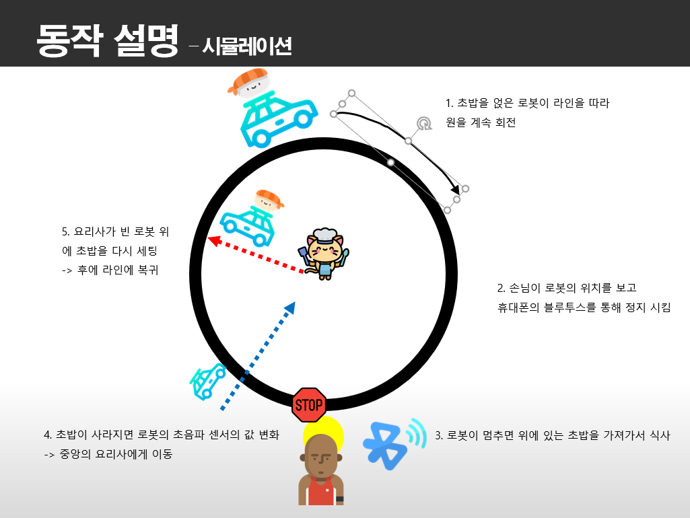

## IOT-TermProject

### 1. 개요

로봇이 위에 초밥을 싣고 라인을 따라 움직이면서 손님에게 배달하는 서비스입니다.

### 2. 구성

- EV3 광센서, 레고 초음파 센서, 라인 트레이서

- Actuater : 모터 2개

- ESTK 보드 1개

- Bluetooth 모듈 1개

### 3. 동작 

1. 초밥을 얹은 로봇이 라인을 따라 원을 계속 회전

2. 손님이 로봇의 위치를 보고 휴대폰의 블루투스를 통해 정지 시킴

3. 로봇이 멈추면 위에 있는 초밥을 가져가서 식사

4. 초밥이 사라지면 로봇의 초음파 센서의 값 변화 -> 다시 출발

5. 요리사가 빈 로봇 위에 초밥을 다시 세팅-> 예외처리

### 변수선언

>#define R_MOTOR_PORT	0	//오른모터 포트
>#define L_MOTOR_PORT	3	//왼모터포트

>#define LINETRACER_PORT	0	//라인트레이서 포트
>#define LIGHT_SENSOR_PORT	1	//광센서 포트
>#define SOUND_SENSOR_PORT	3	//피치센서 포 트

>#define DEFAULT_SPEED	300//기본 모터 속도

>#define STATE_NORMAL	0	//주문 전
>#define STATE_ORDERED	1	//주문 들어왔음

>#define STATE_WRONG		2	//로봇이 목표지점에서 멀어질때
>#define STATE_GOAL		3	//로봇이 목표지점에 도달했을때

>#define EMPTY 0			//초밥 없음
>#define FILLED 1		//초밥 있음

>ev3_color_t ev3_color;	// 현재로봇위치
>color_mode_t sensor_mode = COL_COLOR; //컬러센서 모드
>#define MAC_ARRAY_SIZE	5 // 컬러센서 모드

>#define LOCK	1
>#define UNLOCK	0

>#define PLAY_TIME	60 // 경기시간
>#define TIME_OUT	700//회전함수 타임아웃

>int flag = LOCK;
>int plate;			//초밥 그릇 상태
>int signal;			//신호값
>int table_num;		//테이블 번호  2 , 3 , 4
>int current_state = STATE_NORMAL; //= STATE_CORRECT;
>int current_color = WHITE;
>int previous_color = WHITE;

>int Gain1 = 5;	// 회전 함수 제어 계수 (각도)
>int Gain2 = 7;	// 회전 함수 제어 계수 (속도)

>int linearr[8]; // 라인트레이서 배열

### Usermain

int r;

	printf("\n\n\n\r");
	printf("================================================================================\n\r");
	printf("exe_ubinos_test (build time: %s %s)\n\r", __TIME__, __DATE__);
	printf("================================================================================\n\r");

	// 초기화
	motor_init();
	//encoder_init();
	sensor_init(EV3_LINE_FOLLOWER_SENSOR,0,NXT_DIGITAL_SENSOR_SONA,0); // 라인트레이서, 초음파 센서 초기화
	ev3_sensor_init(LIGHT_SENSOR_PORT, sensor_mode); //광센서 초기화
	glcd_init();
	//switch_init(sw1_isr, sw2_isr);

	//라인트레이서 모드 설정
	modeSelectLine(1);

	// 태스크 생성
	r = task_create(NULL, start_end_task, NULL, task_gethighestpriority(), 500, NULL);
			if (0 != r) {
				logme("fail at task_create\r\n");
			}

	r = task_create(NULL, check_state_task, NULL, task_gethighestpriority(), 500, NULL);
			if (0 != r) {
				logme("fail at task_create\r\n");
			}

	r = task_create(NULL, move_robot_task, NULL, task_gethighestpriority() , 500, NULL);
			if (0 != r) {
				logme("fail at task_create\r\n");
			}

	r = msgq_create(&BT_user_event_queue, sizeof(BT_Evt_t), MAIN_MSGQ_MAX_COUNT);
			if (0 != r) {
				logme("fail at task_create\r\n");
			}

	ubik_comp_start();
	glcd_printf("\nStart Robot\r\n");

	return 0;
}

